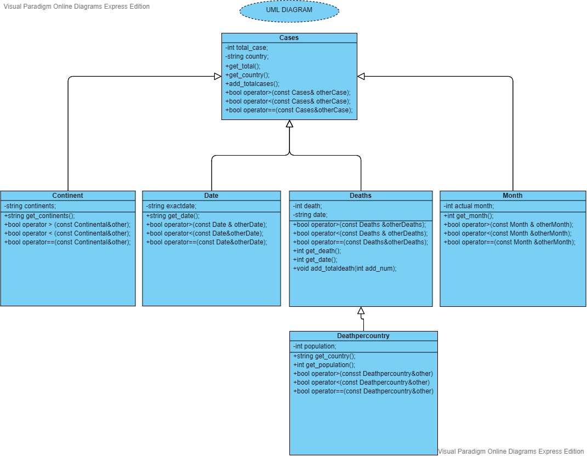
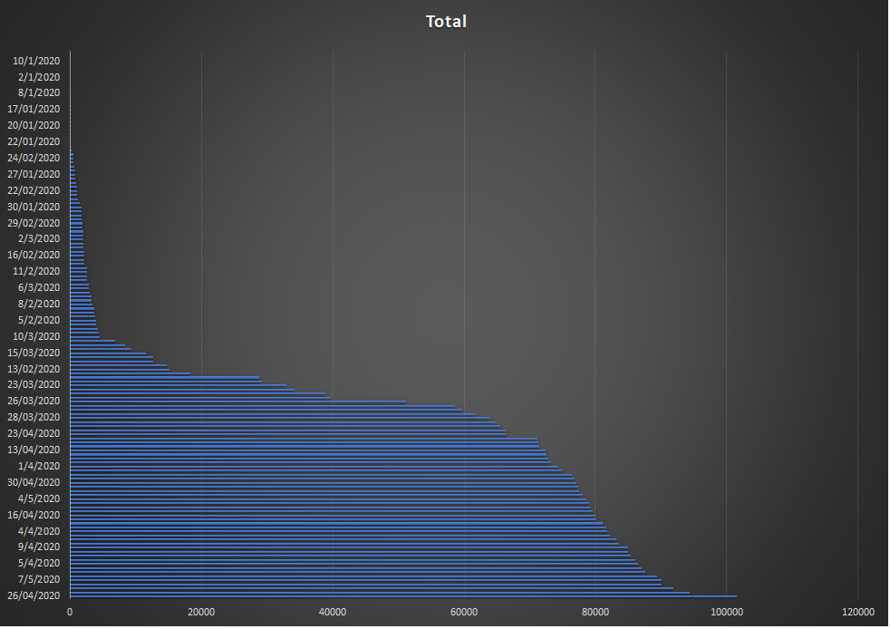
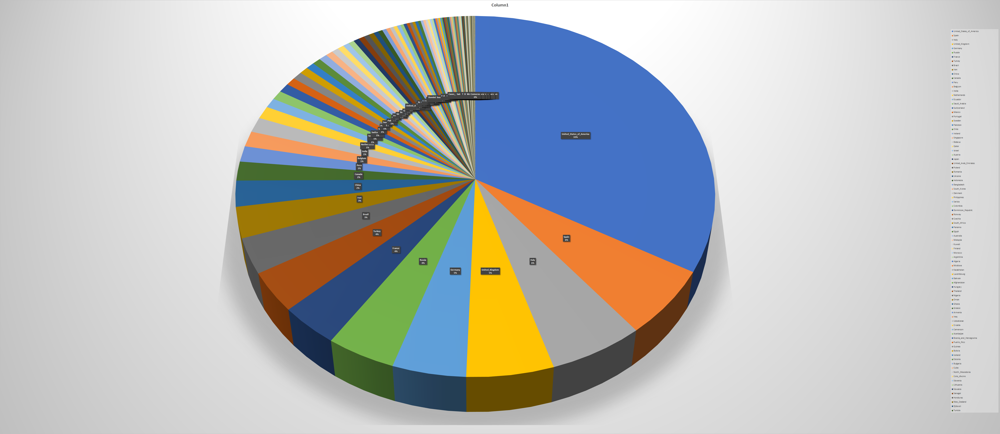
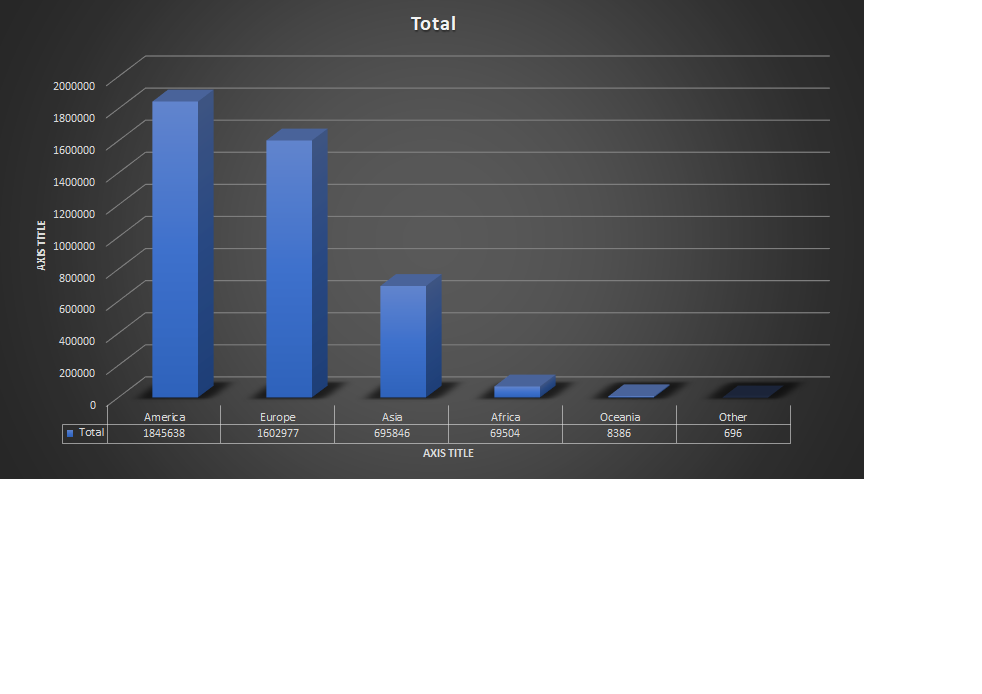
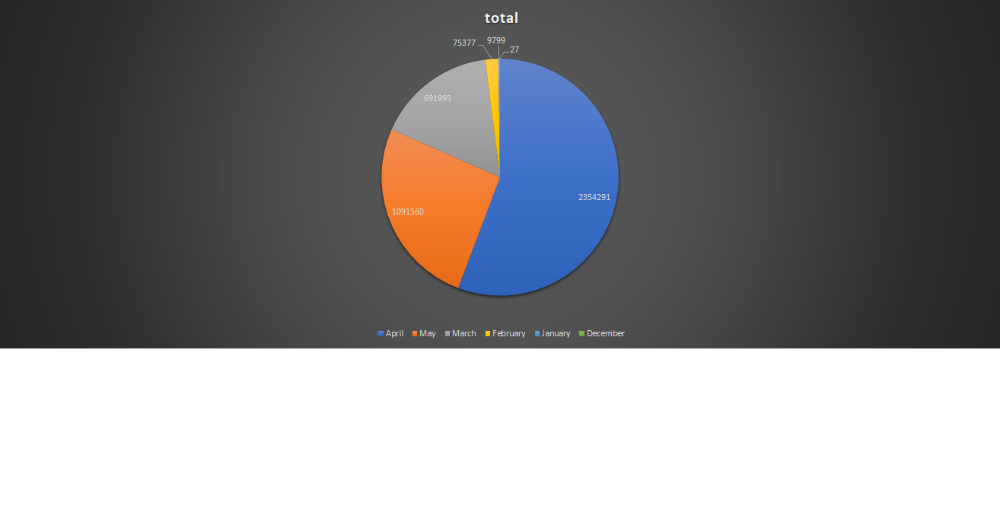
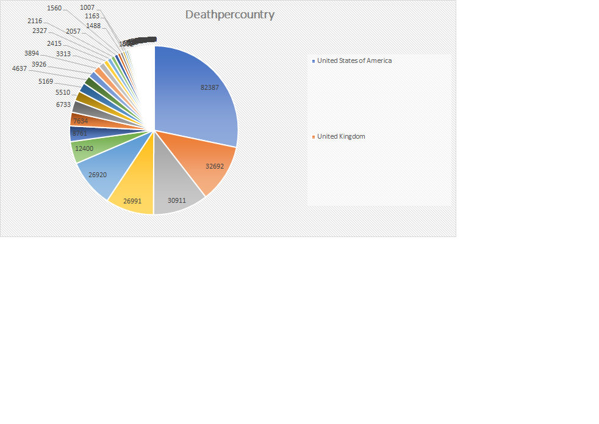
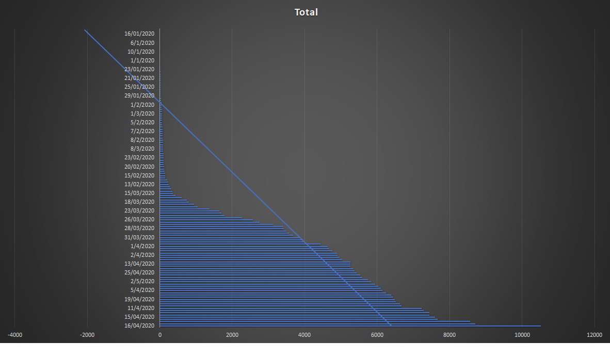
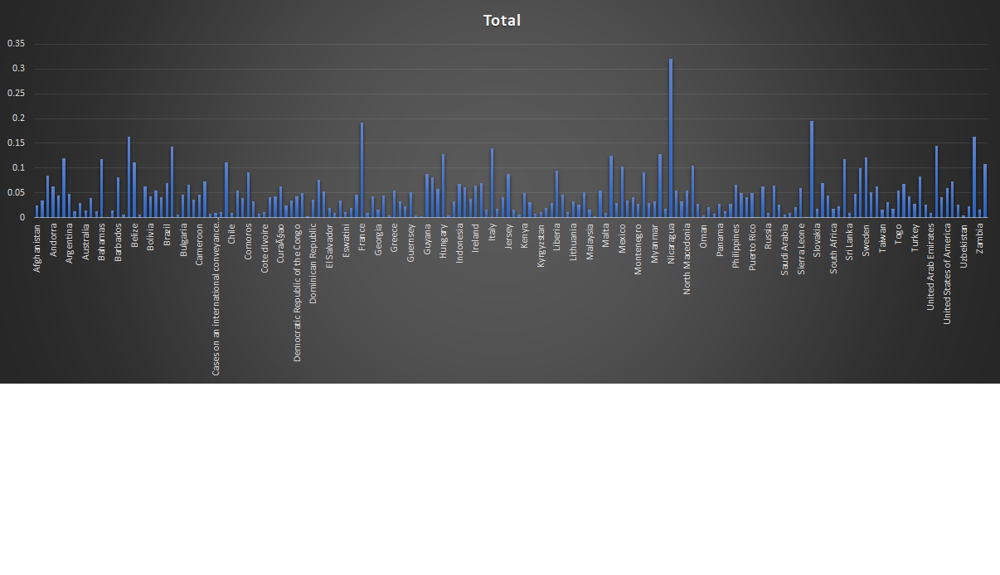
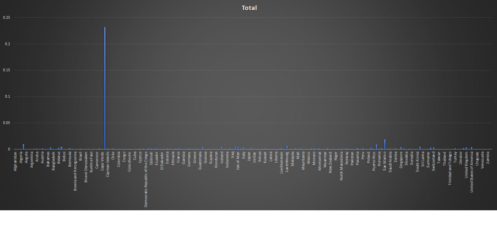

<!-- Headings -->
# CORONA VIRUS (COVID-19) Data Analyzer
## MICHAEL LIE - SCOTT GRIFFITH CS 172-3

<!-- Links -->
## Data Source:
(https://opendata.ecdc.europa.eu/covid19/casedistribution/csv/)

## Code Source: 
### __Professor Scott Griffith__ Binary Sort base

## Purpose of this program:
* To give the information about this virus and the statistical of the virus in different country, teritory and dates. 
* The goal is to increase the awareness and the importance of stay at home order 
* To manipulate a rawdata about corona virus cases so it could be seperated into a different files and each files has their own statistic purposes
* To show the progression of each country and how Corona Virus affects each country (Cases, Death Cases, etc.)
* To count the infection rate of each country
* To count the deathrate in each country

## Code implementation:
      - String 
      - Binary Sort
      - Binary Search
      - Inheritance
      - Object Oriented Design
      - Dynamic memory & Pointer
      - Vector
      - File Input & Output

## User action assumption:
I assume that the user will understand my code easily and why I want to sort the statistic. File formatting are in csv to give better visualization to the user (graph and statistic).

## Class UML Diagram:
<!-- Images -->

## How to run the program (Manuals):
* Build the program first
* Run it
* There will be a question which asking whether the user want to update the file or not.
  * The Program will display the current cases and displaying the current date
  * User could update it by typing (Yes/yes) to update the cases
  * If the user input yes, it will ask the number of days to be updated
  * Input the new cases and new death cases to the program
* Program has been run successfully
* Proceed to look at the file output.
* There are 8 or 10 different csv files displaying different statistic depending on the user input, they are waiting for the user and the program has sorted them!
* Better visualization can be found here at the end of the MD file. (Graph and Statistic)
* Program finish, thank you for Viewing my code!

## Main Code:
* Base Class: Cases.h
* Inherited Class from Cases.h:
  * Continent.h -> tracking the Continent and Comparing the cases from each continent
  * Day.h -> tracking the day and Comparing the cases from each day
  * Deathpercountry.h -> tracking the Death cases from each country and compare the death cases from each country
  * Deaths.h -> tracking the death cases from each date and compare the death cases from each date
  * Month.h -> tracking the cases from each month and compare the cases between month
* Function header:
  * Binarysort.h -> Sorting the vector in order.
  * Checkvector.h -> Checking whether a variable is already inside the vector or not.
  * Inputfunction.h -> Reading the file input and prompt user for input.
  * Outputfile.h -> Outputting the information to 10 different files depending on the purpose of each file.
  * bool operator (<,>,==) is added to each class to compare specific variable inside the class

##  Program Output File:
|             Files              |                       Purpose                        |
| :----------------------------: | :--------------------------------------------------: |
|    1.output_case_a_day.csv     |             Showing sorted case per day              |
|   2.output_case_a_month.csv    |            Showing sorted case per month             |
| 3.output_case_per_country.csv  |           Showing sorted case per country            |
|    4.output_continents.csv     |          Showing sorted case per continent           |
| 5.output_Death_per_country.csv |           Showing sorted death per country           |
|   6.output_death_per_day.csv   |             Showing sorted death per day             |
|     7.output_deathrate.csv     |            Showing deathrate per country             |
|   8.output_infectionrate.csv   |       Showing infectionrate per country              |
|    9.World cases update.csv    |    Showing the updated cases based on user input     |
|   10.World death update.csv    | Showing the updated death cases based on user input  |
|           __Total__            |                       10 Files                       | 

### Future Work and Reflection:
There are a lot of things that I need to improve for the continuity of this program. Such as, I have to implement exponential growth and differential equation to calculate when the corona virus will end and when will it reaches te peak moment. I also need to improve the update functions from my program, so in the future the code would be more practical and useful to give the projection of the virus. I learned a lot on how to modify a file and gather different information and classify them into different class. This is my first time creating this kind of program and through out the creation of the program, I learned that with a good classification, the code will be more organize and it could be easiy done.

# Visual images of the Statistic:
<!-- Images -->
## Cases per date

## Cases per Country

## Cases per Continent

## Cases per Month

## Death Cases per Country

## Death cases per date

## Death rate per country

## Infection rate per country

